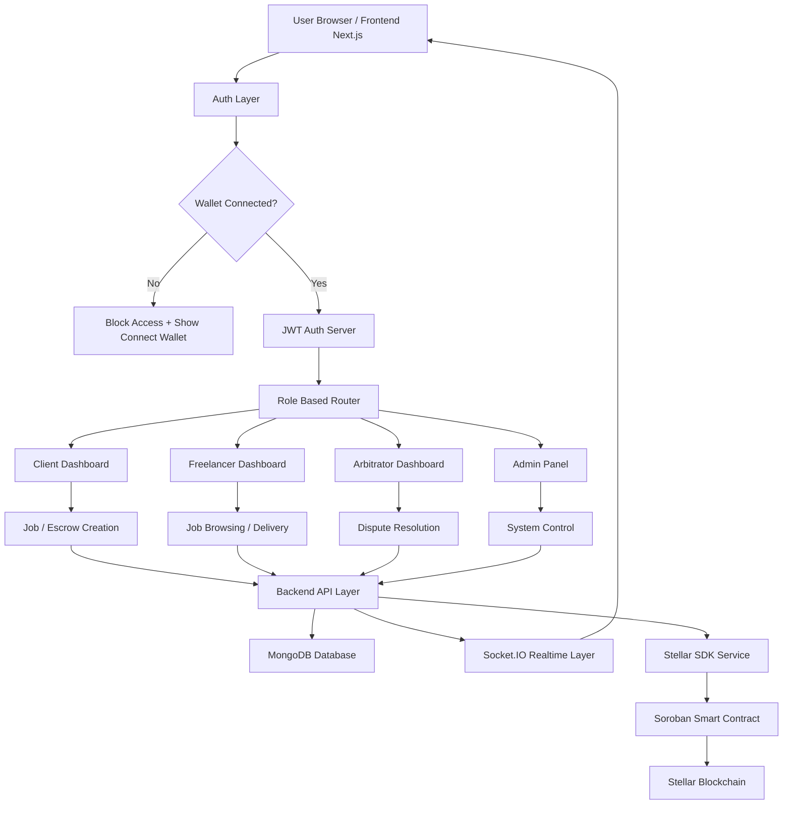
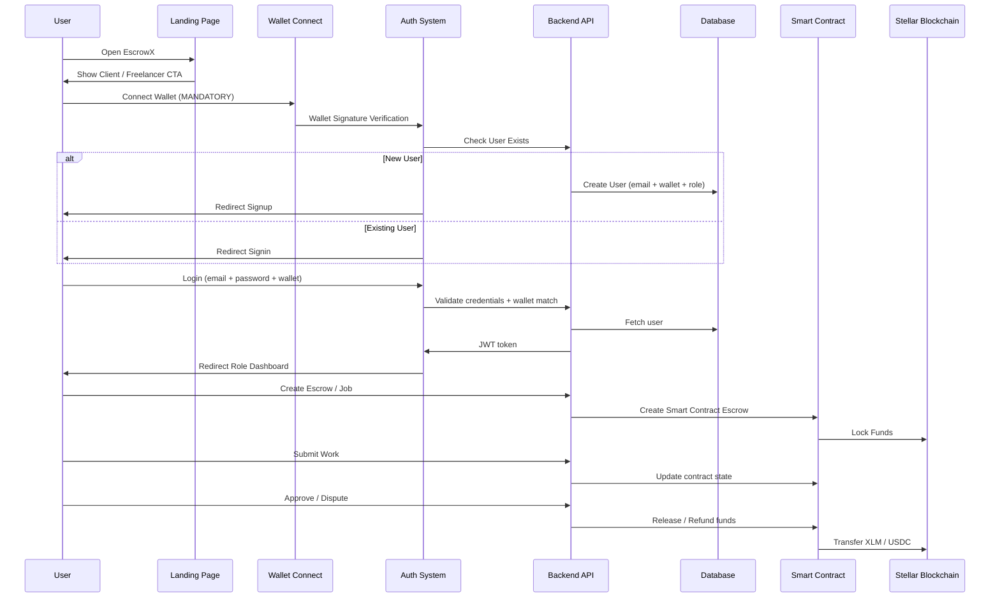

# 🚀 EscrowX - Decentralized Freelance Escrow Marketplace 

A **next-generation decentralized freelance escrow system** built on **Stellar blockchain + Soroban smart contracts**, enabling trustless hiring, milestone-based delivery, and secure fund locking between clients and freelancers.

---

# 🌟 What is EscrowX?

EscrowX is a **Web3 freelance marketplace system** where:

- Clients MUST fund escrow before publishing a job
- Freelancers work only on funded projects
- Funds are locked inside smart contracts (not platform wallets)
- Payment is released ONLY after client approval

👉 This removes scams, chargebacks, and trust issues in freelancing.

---

# ⚠️ Current Problem (Real World)

Traditional platforms like Fiverr / Upwork:

- Client can cancel after receiving work
- Freelancer can be scammed
- Platform controls funds (centralized risk)
- No real ownership or transparency

---

# 💡 EscrowX Solution

EscrowX fixes this using blockchain escrow:
```text
Client Wallet
↓
Soroban Smart Contract (EscrowX)
↓
LOCKED FUNDS
↓
Released only after approval OR refunded
```
---

# 🧠 Real World Example

👉 John hires a designer

Old System:
John receives logo → refuses payment ❌ scam

EscrowX System:
John funds escrow → cannot access work until approval ✔ safe

---

## 🏆 Stellar Journey to Master
## 🧭 Belt System Progress
 
| Level | Belt | Focus | Status |
|-------|------|-------|--------|
| ⚪️ Level 1 | White Belt | Wallets & transactions | ✅ Completed |
| 🟡 Level 2 | Yellow Belt | Multi-wallet, contracts & events | ✅ Completed |
| 🟠 Level 3 | Orange Belt | Mini dApp + tests | ✅ Completed |
| 🟢 Level 4 | Green Belt | Advanced contracts & production readiness | ✅ Completed |
| 🔵 Level 5 | Blue Belt | Real MVP (5+ users) | 🔜 Upcoming |
| ⚫️ Level 6 | Black Belt | Scale + Demo Day readiness | 🔜 Upcoming |
 
---

## 🟢 Current Status: GREEN BELT (Completed)

 ## 📋 Contract Addresses (Testnet)

| Name | Address |
|------|---------|
| 🔐 Main Escrow Contract (v2) | `CCSJJFN2GRTNPGDYM7XPVEFCQ6NHRE7P7NVR4KAR2UISXQTWPIB6EYSB` |
| 💎 Native XLM Token (SAC) | `need to add ` |
| 🪙 Custom SPAY Token | `need to add ` |

---

## 🔗 Transaction Hashes (Testnet)

| Action | TX Hash |
|--------|---------|
| Contract Deploy ID | `CCSJJFN2GRTNPGDYM7XPVEFCQ6NHRE7P7NVR4KAR2UISXQTWPIB6EYSB` |
| Deposit (XLM) | `need to add ` |
| Inter-Contract Call | `need to add ` |

---
## 🧠 HIGH LEVEL SYSTEM ARCHITECTURE

---
## 🏗️ USER WORKFLOW ARCHITECT

---
## ⛓ SMART CONTRACT ARCHITECTURE
```mermaid
flowchart TD

SC[Escrow Smart Contract]

SC --> C1[createEscrow()]
SC --> C2[fundEscrow()]
SC --> C3[markInProgress()]
SC --> C4[markDelivered()]
SC --> C5[approveDelivery()]
SC --> C6[requestRefund()]
SC --> C7[refundEscrow()]
SC --> C8[raiseDispute()]
SC --> C9[resolveDispute()]
SC --> C10[getEscrow()]
```
---
# 🔄 CORE WORKFLOW (IMPORTANT)
```text
Client
  ↓
Continue & Fund
  ↓
createEscrow()
  ↓
fundEscrow()
  ↓
Funds LOCKED in Soroban Contract
  ↓
Listing Published
  ↓
Freelancer Applies
  ↓
Client Accepts Freelancer
  ↓
Work Starts
  ↓
Freelancer Delivers
  ↓
Client Approves
  ↓
approveDelivery()
  ↓
Funds → Freelancer
```
---

# 🏗 Tech Stack

Frontend
- Vite + TypeScript
- React UI
- Freighter Wallet Integration

Backend
- Node.js + Express
- MongoDB 
- Transaction logging

Blockchain Layer
- Stellar Testnet
- Soroban Smart Contracts

---

# ⛓ SMART CONTRACT (SOROBAN)

Contract ID (Testnet)
UPCOMING / NOT SET YET

---

## ⚙️ Contract Functions

- createEscrow()
- fundEscrow()
- markInProgress()
- markDelivered()
- approveDelivery()
- requestRefund()
- refundEscrow()
- raiseDispute()
- resolveDispute()
- getEscrow()

---
```text
# 📊 ESCROW STATE MACHINE

PENDING
  ↓
FUNDED
  ↓
IN_PROGRESS
  ↓
DELIVERED
  ↓
COMPLETED

---

Revision Flow:

DELIVERED
  ↓
REVISION_REQUESTED
  ↓
DELIVERED
  ↓
COMPLETED

---

Dispute Flow:

DELIVERED
  ↓
DISPUTED
  ↓
REFUNDED

OR

DELIVERED
  ↓
DISPUTED
  ↓
COMPLETED

---

# 🔥 WHY EscrowNotFound HAPPENS

Continue & Fund
   ↓
Money sent
   ↓
createEscrow() NOT called
   ↓
Escrow does not exist
   ↓
markDelivered() → EscrowNotFound

---

# ✅ CORRECT RULE

Continue & Fund
   ↓
createEscrow()
   ↓
fundEscrow()
   ↓
Store escrowId in DB
   ↓
Publish listing ONLY AFTER SUCCESS
```
---

# 🔗 FRONTEND ↔ CONTRACT FLOW

Frontend NEVER stores money.

React UI
↓
Freighter Wallet
↓
Soroban Smart Contract
↓
Blockchain State
↓
Backend Sync
↓
UI Update

---

# 🎯 FUNCTION MAPPING

Create Escrow → createEscrow()
Fund Escrow → fundEscrow()
Start Work → markInProgress()
Deliver Work → markDelivered()
Approve Work → approveDelivery()
Request Refund → requestRefund()
Refund → refundEscrow()
Raise Issue → raiseDispute()
Resolve Issue → resolveDispute()
View Status → getEscrow()

---

# 👥 ROLE SYSTEM

Client:
- createEscrow
- fundEscrow
- approveDelivery
- requestRefund
- raiseDispute

Freelancer:
- markInProgress
- markDelivered

Admin:
- resolveDispute

---

# 📦 PROJECT STRUCTURE

frontend/
 ├── src/
 │   ├── app/
 │   ├── components/
 │   ├── hooks/
 │   ├── lib/
 │   ├── config/
 │   └── assets/

contracts/
 ├── escrow-contract/
 │   ├── src/
 │   │   ├── lib.rs
 │   │   ├── types.rs
 │   │   ├── storage.rs
 │   │   ├── escrow.rs
 │   │   ├── errors.rs

---

# 🧾 FUNDING FLOW

Step 1:
Continue & Fund clicked

Step 2:
createEscrow()

Step 3:
fundEscrow()

Step 4:
Funds go:

Client Wallet
↓
Soroban Contract (LOCKED)

NOT treasury wallet ❌

---

# 🔐 SECURITY MODEL

- No direct treasury wallet
- Funds locked in contract
- State-based execution only
- No bypass allowed

---

# 📈 CURRENT STATUS

Level 3 (Orange Belt)

Completed:
✔ Wallet integration  
✔ Contract deployment  
✔ Escrow creation  
✔ Funding flow  
✔ Basic state machine  
✔ getEscrow working  

In Progress:
- Delivery system
- UI workflow
- dispute module

---

# 🚀 NEXT ROADMAP

- Delivery Vault system
- File locking system
- Real-time escrow tracker
- Dispute system
- Production mainnet deployment

---

# 🧠 FINAL VISION

EscrowX = Fiverr + Upwork + Blockchain escrow trust layer

---

# ⚡ CORE RULE

If escrow not created → nothing exists  
If escrow not funded → not visible  
If not approved → money never moves
